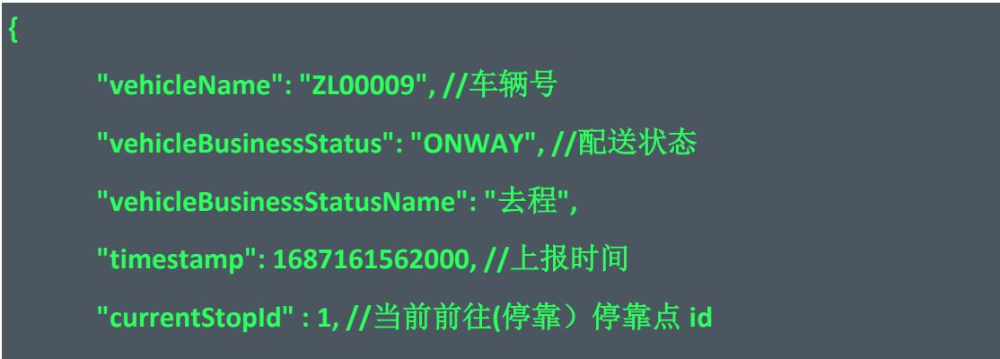

# 3 无人车业务状态推送接口

topic：{organizationCode}/vehicle/+/business/push

样例：04abcdefg/vehicle/+/business/push

接口备注：推送车辆的业务状态

推送条件：车辆的业务状态发生变化的时候，推送一次

数据结构说明：

<table><tr><td>参数名</td><td>示例值</td><td>参数类型</td><td>参数描述</td></tr><tr><td>vehicleName</td><td>ZL00009</td><td>String</td><td>车辆号</td></tr><tr><td>vehicleBusinessStatus</td><td>ONWAY</td><td>String</td><td>配送状态.附录3.1</td></tr><tr><td>vehicleBusinessStatusName</td><td>去程</td><td>String</td><td>配送状态名称</td></tr><tr><td>cancelled</td><td>true</td><td>Boolean</td><td>是否主动取消导致的配送状态空闲，true表示取消导致，false表示任务正常完成</td></tr><tr><td>cancelUser</td><td>张三</td><td>String</td><td>取消任务的用户信息</td></tr><tr><td>timestamp</td><td>1687161562000</td><td>Integer</td><td>上报时间</td></tr><tr><td>currentGoallIndex</td><td>1</td><td>Integer</td><td>车辆任务当前目的地Index，0表示还未触发，1表示去往第一个停靠点或者已经到第一个达停靠点，可结合车辆业务状态和点位列表来判断</td></tr><tr><td>currentStopId</td><td>1</td><td>Integer</td><td>当前前往(停靠)停靠点id。如果是去程或者返程，则表示前往的点。如果是投递中，表示当前停留等待的点位。</td></tr><tr><td>currentStopName</td><td>红新校区</td><td>String</td><td>前往(停靠)停靠名称</td></tr><tr><td>lastStopId</td><td>2</td><td>Integer</td><td>上一个停靠点ID</td></tr><tr><td>lastStopName</td><td>东风路口</td><td>String</td><td>上一个停靠点名称</td></tr><tr><td>currMileages</td><td>1300</td><td>Double</td><td>当前停靠点的规划里程。单位:米</td></tr><tr><td>currPlanElapsedTime</td><td>35.2</td><td>Double</td><td>此路段预计耗时。单位:分钟。根据最近5天的历史数据预估。</td></tr><tr><td>currPlanAvgSpeed</td><td>6.3</td><td>Double</td><td>最近5天历史任务中当前路段的平均速度。单位:米/秒</td></tr><tr><td>dispatchId</td><td>1508</td><td>Long</td><td>九识的任务编号</td></tr><tr><td>orderList</td><td></td><td>Array</td><td>订单列表。使用九识小程序/app进行业务才会推送这个数据</td></tr><tr><td>orderList.id</td><td></td><td>Integer</td><td></td></tr><tr><td>orderList.orderNo</td><td>202311201236548</td><td>String</td><td>九识内部订单编号</td></tr><tr><td>orderList-originalNo</td><td></td><td>String</td><td>客户订单编号。若无,同orderNo</td></tr><tr><td>orderList(contact</td><td>13512547858</td><td>String</td><td>取货人手机号</td></tr><tr><td>orderList.name</td><td>张三</td><td>String</td><td>取货人姓名</td></tr><tr><td>orderList.stopName</td><td>小区南门</td><td>String</td><td>订单取货点名称</td></tr><tr><td>orderList.stopId</td><td>156</td><td>Integer</td><td>订单取货点id,唯一值</td></tr><tr><td>orderList.gridNo</td><td>1,2,3</td><td>String</td><td>订单放的箱门。可以是一个也可以是多个</td></tr><tr><td>orderList取证Code</td><td>125489</td><td>String</td><td>订单6位验证码</td></tr><tr><td>orderList.orderStatus</td><td>PICKED</td><td>String</td><td>订单状态编码</td></tr><tr><td>orderList.orderStatusName</td><td>已取</td><td>String</td><td>订单状态名称。参考附录3.2</td></tr></table>

请求示例：



```javascript
"currentStopName":"红新校区",//前往(停靠）停靠名称   
"dispatchld":1506,   
"orderList":[ { "id":171, "orderNo":"20231103170110483", "originalNo":"20231103170110483", "orderStatus":"PICKED", "orderStatusName":"已取", "contact":"15726608952", "name":"chenzhen", "stopId":2238, "stopName":"测试11", "gridNo":"1,2,4", "verifyCode":"849201" } 1 
```