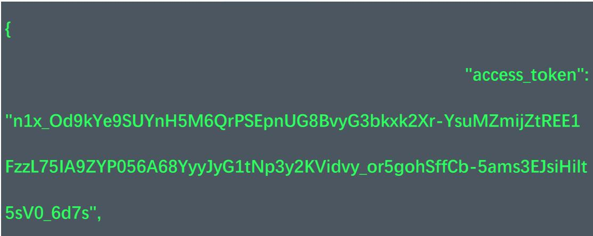

# 接入步骤

## 1.3 Access token 的获取

测试环境URL: https://auth-uat.zelostech.com.cn/oauth-token

线上环境URL：https://auth.zelostech.com.cn/oauth-token

Content-Type: application/x-www-form-urlencoded

请求方式：post

接口备注：该接口由三方服务端去调用，用于根据用户名密码获取 token。

生成的 token 有效期默认是 24 小时,三方需要注意过期后刷新页面的时机,

否则页面在 token 失效后会显示相关失效的错误提示

请求参数说明：  

<table><tr><td>参数名</td><td>示例值</td><td>参数类型</td><td>是否必填</td><td>参数描述</td></tr><tr><td>grant_type</td><td>username_password_authorization_code</td><td>String</td><td>是</td><td>固定值
username_password_authorization_code</td></tr><tr><td>client_id</td><td></td><td>String</td><td>是</td><td>应用的 client_id，九识提供</td></tr><tr><td>client_secret</td><td></td><td>String</td><td>是</td><td>应用的 client_secret，九识提供</td></tr><tr><td>username</td><td></td><td>String</td><td>是</td><td>客户公司下的某个用户名</td></tr><tr><td>password</td><td></td><td>String</td><td>是</td><td>客户公司下的某个用户名对应的密码</td></tr></table>

返回参数说明（以下列出了关键的字段）：  

<table><tr><td>参数名</td><td>示例值</td><td>参数类型</td><td>参数描述</td></tr><tr><td>success</td><td>true</td><td>Boolean</td><td>成功响应</td></tr><tr><td>errorCode</td><td>null</td><td>String</td><td>暂无描述</td></tr><tr><td>message</td><td>null</td><td>String</td><td>暂无描述</td></tr><tr><td>data</td><td></td><td>Object</td><td>返回数据</td></tr><tr><td>data.access_token</td><td>n1x_Od9kYe9SUYnH5M6QrPSEpnUG8BvyG3bkxxk2Xr-YsumMZmijZtREE1FzzL75IA9ZYP056A68YyyJyG1tNp3y2KVidvy_or5gohSffCb-5ams3EJsiHilt5sV0_6d7s</td><td>String</td><td>access_token 值，用于生成嵌入的页面url</td></tr><tr><td>data.user_name</td><td>Colin</td><td>String</td><td>用户名</td></tr><tr><td>data.organization_name</td><td>九识科技</td><td>String</td><td>用户的公司名称</td></tr><tr><td>datails expires_in</td><td>86299</td><td>Integer</td><td>Token 多久后过期，单位 S</td></tr></table>

返回示例：



```json
"user_type": "USER_TYPE_NORMAL",  
"user_id": 9999999,  
"user_name": "Colin",  
"scope": "all",  
"organization_id": 9999999,  
"organization_type": "THIRD",  
"organization_name": "九识科技",  
"token_type": "Bearer",  
"mobile_number": "18888888888",  
"Expires_in": 86299,  
"email": "xxxxxxxxxx@xxxxxx.com"  
} 
```

## 1.4页面url生成

使用上一步生成的access token，拼接如下的url（注意线上域名不一样），作为ifame的src属性值

### 1.4.1 多车页面

测试环境：https://view-uat.zelostech.com.cn/?accessToken={xxxx}

线上环境：https://view.zelostech.com.cn/?accessToken $\equiv$ {xxxx}

例如：

https://view-uat.zelostech.com.cn/?accessToken=tAm9L3minz3dPs2r_QY3iD4gMrJFOaS7IRQzegKIS ANSely

9Sr0ErMYDKD2PvSKh-e_le2dRdHfOqEGV06D-DOtAWNne-UxhIDZbBSfbgSrRgYNzKRMSFvj5rlbImo0

### 1.4.2 单车页面

测试环境：https://view-uat.zelostech.com.cn/vehicle/{vehicleName}?accessToken $\equiv$ {xxxxx}

线上环境：https://view.zelostech.com.cn/vehicle/{vehicleName}?accessToken $\equiv$ {xxxx}

例如：

https://view-uat.zelostech.com.cn/vehicle/ZL00075?accessToken=tAm9L3minz3dPs2r QY3iD4qMrJFOaS7IR

QzegKIS ANSely9Sr0ErMYDKD2PvSKh-e le2dRdHfOqEGV06D- DOtAWNnE-uXhlDZbBSfbgSrRqYNzKRMSF

vj5rblmo0